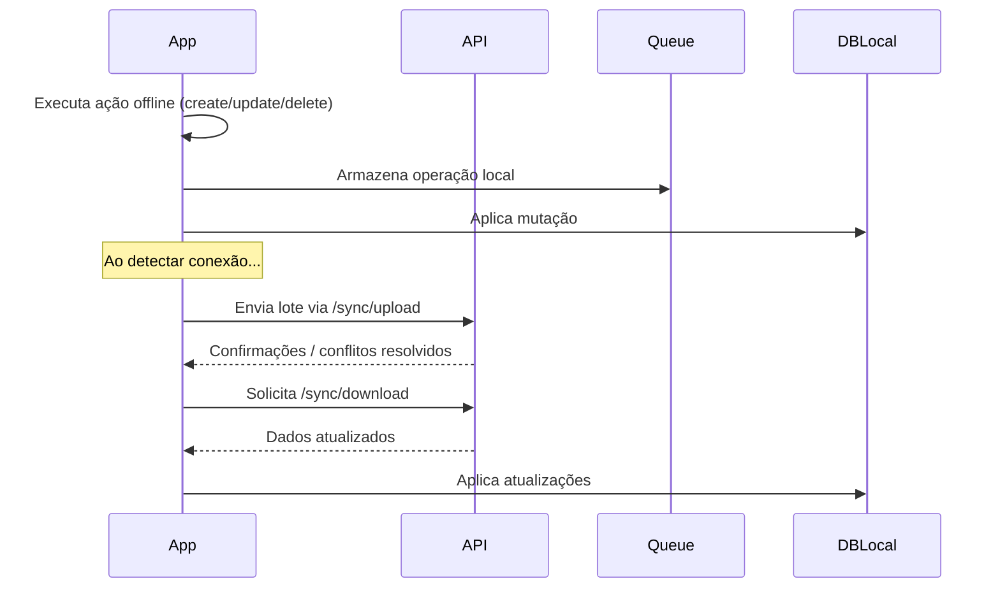

# 📦 Offline-First e Sincronização no App Carteira Zen

Este documento descreve a arquitetura e funcionalidades previstas para um sistema **offline-first** no app _Carteira Zen_, incluindo sincronização com backend FastAPI.

---

## 🎯 Objetivo

Permitir que usuários utilizem o app **mesmo sem conexão**, com sincronização transparente de dados assim que a internet estiver disponível.

---

## 🧱 Arquitetura Sugerida

### Banco de dados local

- [`WatermelonDB`](https://github.com/Nozbe/WatermelonDB) (React Native)
  - Alta performance com sincronização nativa
  - Permite mutações otimizadas e escuta de alterações

### Fila de sincronização (queue)

- Implementação local via SQLite ou memória (com persistência)
- Enfileira todas as operações offline (create, update, delete)
- Cada item contém:
- `id_local`, `tabela`, `tipo_operacao`, `payload`, `timestamp`

```
| Campo         | Tipo                               | Função                     |
|---------------|------------------------------------|----------------------------|
| `id`          | UUID                               | Pode ser gerado offline    |
| `updated_at`  | ISODate                            | Comparação de sincronização|
| `sync_status` | enum {NEW, DIRTY, DELETED, SYNCED} | Controle se já sincronizou |
```

### Backend

- FastAPI com endpoints:
  - `POST /sync/upload`: recebe lote de alterações do client
  - `GET /sync/download`: retorna atualizações do servidor desde um timestamp

---

## 🔁 Estratégia de Sincronização



---

## 📁 Exemplo de Estrutura da Fila

```json
{
  "id": "uuid-v4",
  "tabela": "transacoes",
  "tipo_operacao": "create",
  "payload": {
    "descricao": "Padaria",
    "valor": 15.0
  },
  "timestamp": 1691234567,
  "sincronizado": false
}
```

---

## 🛠 Resolução de Conflitos

- Estratégia: **"última modificação vence"** (`updated_at`)
- Possível extensão: versionamento e histórico

---

## 🔐 Segurança

- JWT enviado normalmente mesmo offline (expira, revalida ao conectar)
- Cache criptografado opcional no dispositivo

---

## 🌐 Endpoint: `POST /sync/upload`

```http
POST /sync/upload
Authorization: Bearer <token>

[
  {
    "tabela": "transacoes",
    "tipo_operacao": "create",
    "payload": {
      "id_local": "abc-123",
      "descricao": "Padaria",
      "valor": 12.5,
      "updated_at": "2025-08-04T10:20:00Z"
    }
  }
]
```

- Retorna lista de `id_local` + `id_backend` mapeados

---

## ⬇️ Endpoint: `GET /sync/download?since=...`

- Retorna alterações desde último sync (com base no `updated_at`)
- Ideal para dados de referência ou compartilhados (ex: categorias, bancos)

---

## 🏆 Futuras Ideias para Plano Premium

- Modo totalmente offline com backup criptografado no dispositivo
- Permitir múltiplas contas sincronizadas (ex: casal)
- Painel web com sincronização cruzada (mobile <> web)
- Histórico de alterações (logs locais e servidor)
- Reconciliação automática de conflitos com sugestões

---

## ✅ Conclusão

Este plano fornece base para um sistema robusto de **sincronização offline-first**, usando tecnologias modernas e seguras. Implementações como WatermelonDB com backend em FastAPI permitem escalabilidade e experiência de usuário fluida.

## 🔄 Fluxo de Estados de um Item (mobile)

rótulo local:

- NEW → criado offline
- DIRTY → editado offline
- DELETED → marcado para remoção offline
- SYNCED → ok com o servidor
